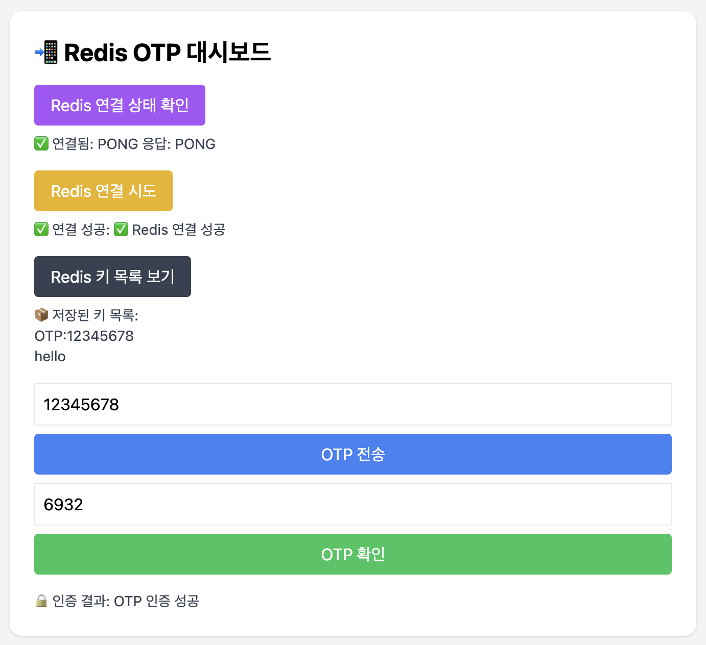
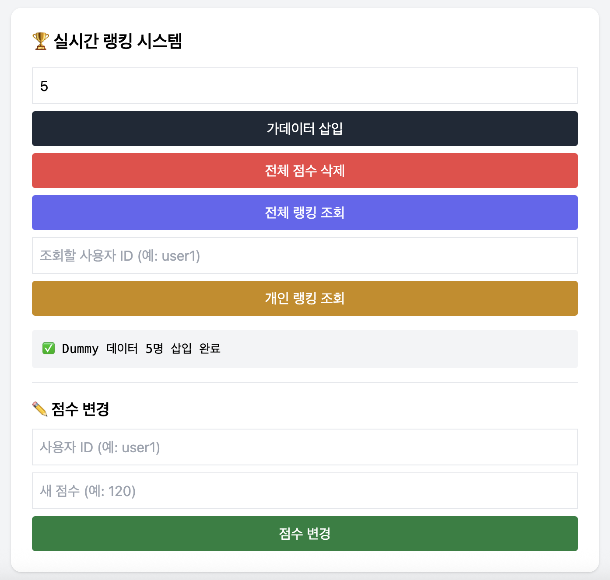
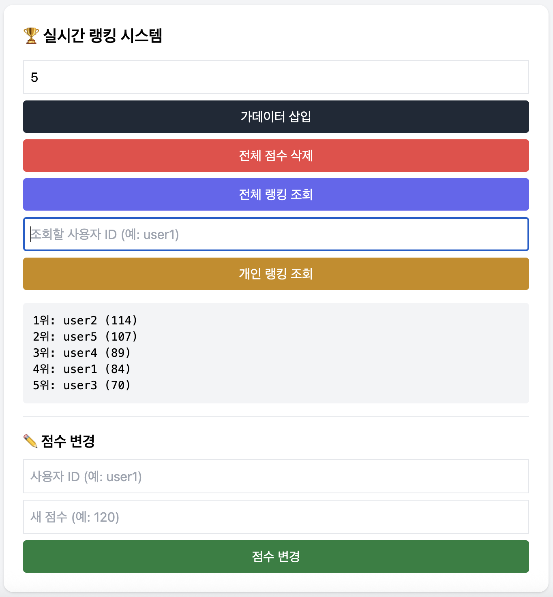
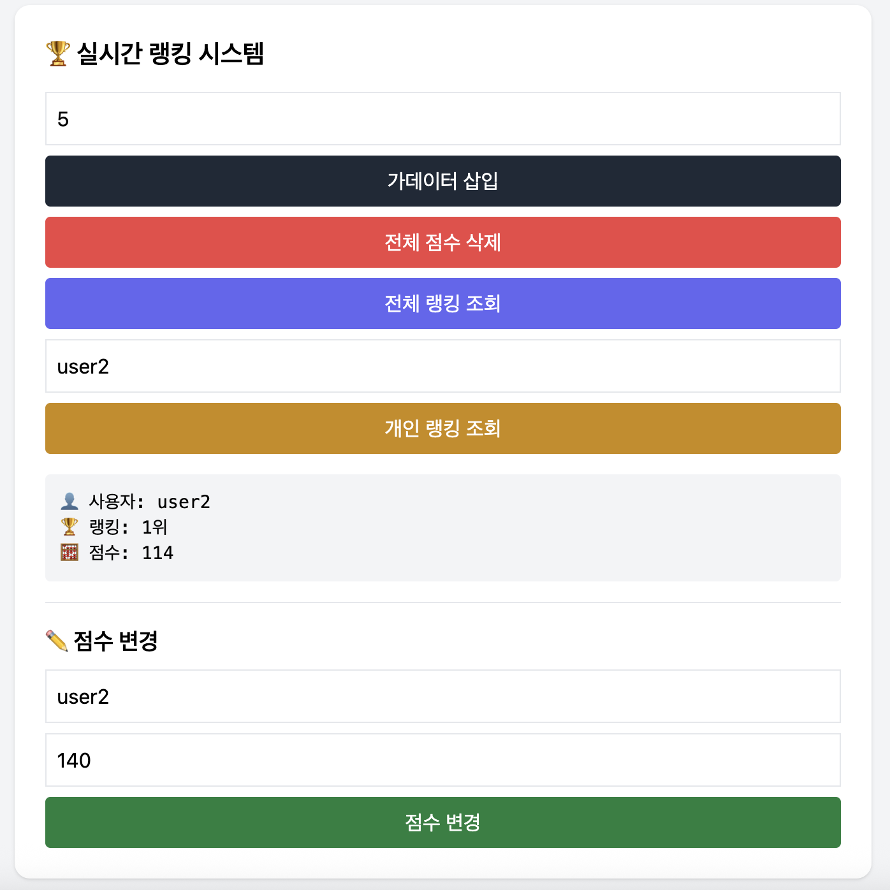
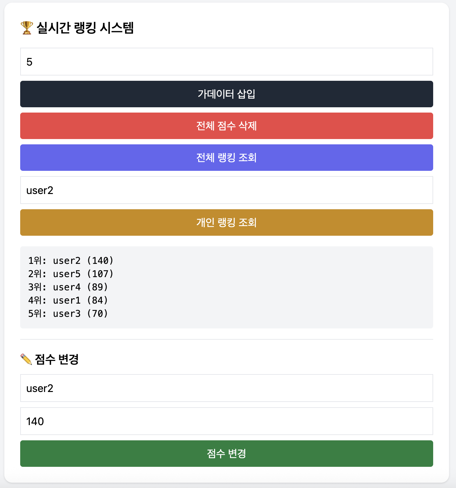

# 🚀 Redis Realtime API Server

Redis를 활용한 OTP 인증, 실시간 랭킹, API 속도 제한, 실시간 채팅 등 고성능 기능을 Redis 기반으로 직접 구현 및 예정입니다.

 

## 🔧 Tech Stack

| Category      | Tech                                  |
|---------------|----------------------------------------|
| Language       | Java 17                               |
| Framework      | Spring Boot 3.5.x                     |
| DB (In-Memory) | Redis 8.x                             |
| Build Tool     | Gradle                                |
| Doc Tool       | SpringDoc OpenAPI (Swagger)           |
| Dev Tools      | DevTools, curl/Postman                |
| Optional       | Docker (for Redis, API), RedisInsight |

 

## 📦 Features Overview

### ✅ 기능 1 — OTP 인증 API (`String + TTL`)

- 사용자의 휴대폰 번호로 OTP(일회용 인증번호) 발급
- Redis에 `otp:{phone}` 형태로 저장 (TTL: 3분)
- 입력한 OTP 값이 Redis에 저장된 값과 일치하는지 확인
- Redis에서 자동 삭제 또는 수동 삭제
  
---

## 🖥️ 1단계 구현 화면 (OTP 인증 + Redis 상태 확인)

> Redis 연결 상태 확인, OTP 발급/검증 및 키 목록 조회 UI 대시보드

### ✅ 기능 2 — 실시간 랭킹 시스템 (`ZSET`)

- Redis의 `ZSET`(Sorted Set)을 활용한 실시간 점수/랭킹 API
- 사용자 ID와 점수를 추가하거나 갱신
- 전체 랭킹 또는 내 랭킹 확인 API 제공

---

## 🏆 2단계 랭킹 화면 (실시간 점수/랭킹 시스템)

> Redis ZSET(Sorted Set)을 활용한 실시간 랭킹 API 시각화 대시보드  
> 가데이터 삽입 → 전체 랭킹 조회 → 개인 조회 → 점수 수정까지 UI 흐름

### 🟢 1. 가데이터 삽입 화면  
사용자 수를 입력하고 Dummy 점수 데이터를 Redis에 삽입한 화면입니다.

---

### 🟢 2. 전체 랭킹 조회 결과

Redis ZSET 데이터를 통해 전체 사용자 점수와 순위를 조회한 결과입니다.

---

### 🟢 3. 개인 랭킹 조회 결과

특정 사용자 ID를 입력하여 해당 사용자의 점수 및 순위를 확인한 화면입니다.

---

### 🟢 4. 점수 수정 결과  
사용자의 점수를 수정하고, 다시 조회 시 반영된 결과를 보여줍니다.

### ✅ 기능 3 — API 속도 제한기 (`INCR + TTL`)

- 클라이언트 IP 또는 사용자 ID 기반으로 초당/분당 요청 횟수 제한
- Redis의 `INCR`와 `EXPIRE`를 활용해 카운팅 및 TTL 설정
- 초과 요청 시 429 (Too Many Requests) 상태코드 응답

---

### ✅ 기능 4 — 실시간 채팅 시스템 (Pub/Sub)

- Redis Pub/Sub 기반 실시간 채팅 시스템
- 채널 구조: chat:room:{roomId}
- PUBLISH → SUBSCRIBE 방식으로 비동기 메시지 송수신

---

## 🙌 마무리

Redis의 다양한 자료구조와 기능을 활용하여 실시간 시스템의 가능성을 실습하고 확장하기 위한 학습 기반 프로젝트입니다.

기능을 하나씩 완성해 나가며 더 나은 구조와 성능을 고민하고,  
실제 서비스에 적용할 수 있는 수준으로 개선해 나가고자 합니다.

더 나은 방향이나 개선 아이디어가 있다면 언제든 환영합니다!  
함께 성장하는 개발자가 되겠습니다. 😊
